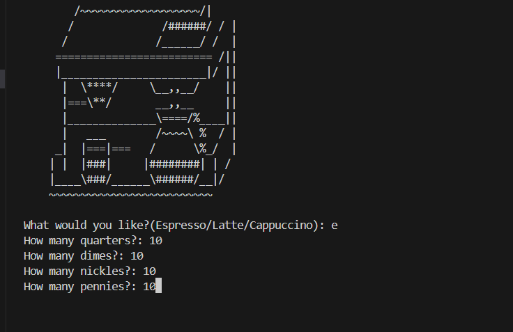
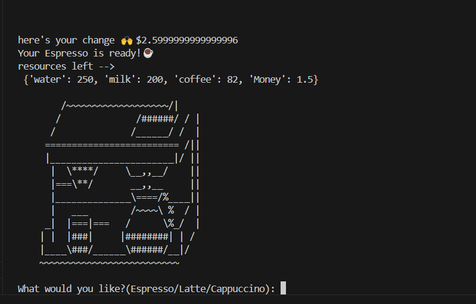
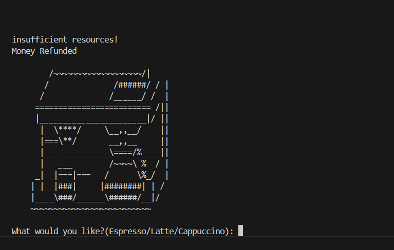
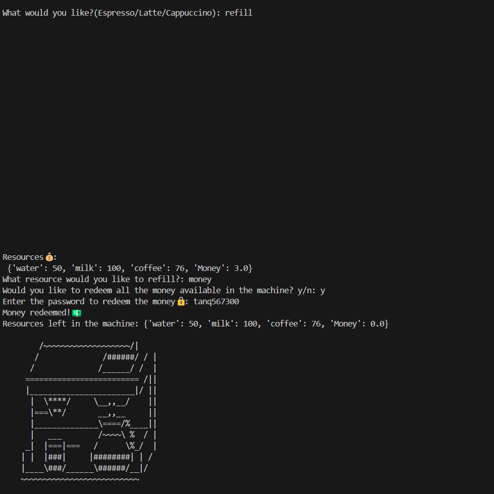
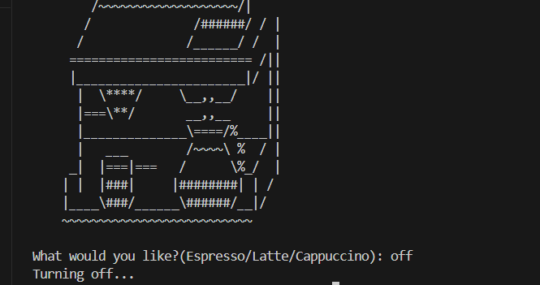

# Coffee_machine
A python script with the functionalities of a coffee machine

## How to Play
 Download the `main.py` and `art.py` files, then execute the `main.py` script. 🖥️ Enjoy brewing your coffee! ☕

## Screenshots

## Credits
This project is part of my journey through Angela Yu's *100 Days of Code: The Complete Python Bootcamp*. While the idea originates from the course, the code logic has been written entirely by me and I've even added a refill mode in which the user can restock the coffee machine and redeem the money collected by the coffee by entering the correct 'PASSWORD'.

Thank you!